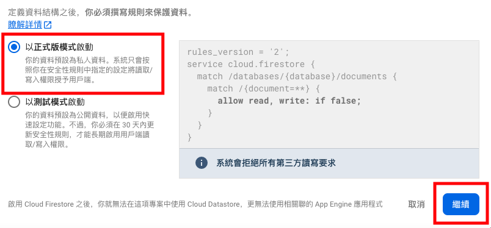
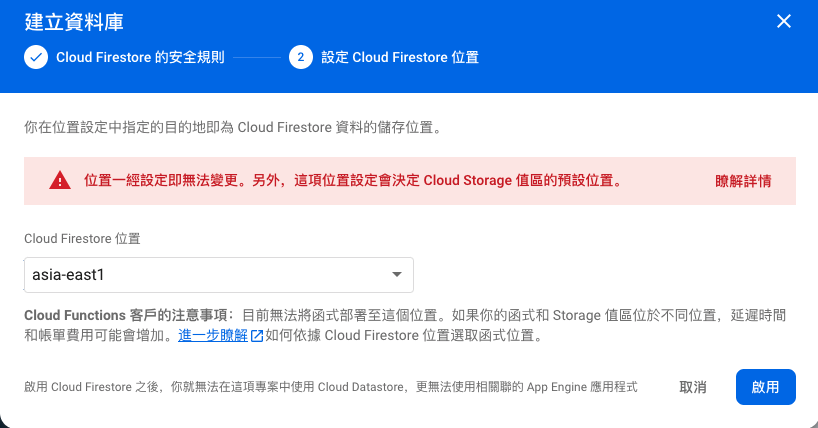
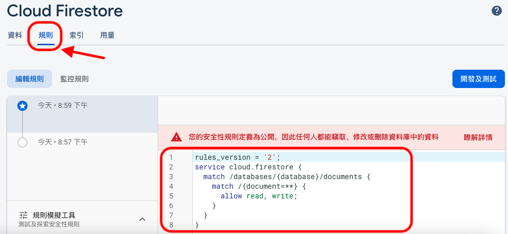
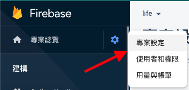
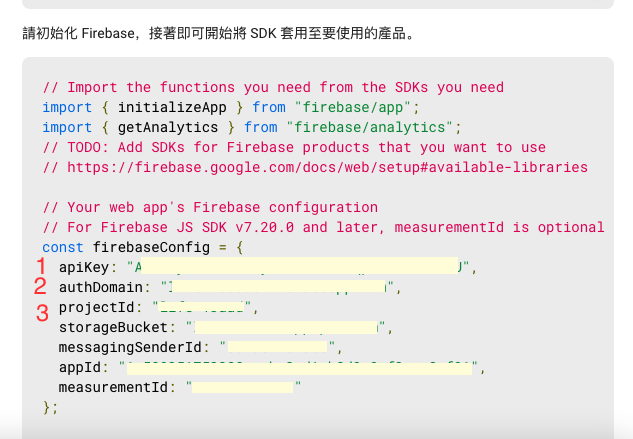
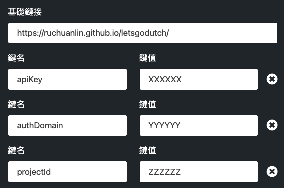

# Let's go dutch!

## Why we need this?

大家一定都遇過以下幾種情境：

- 中午和同事一起叫外送。由一個人先刷卡，然後**其他人給刷卡的那個人錢**。
- 好朋友聚餐。由一個人先買單，然後**其他人給買單的那個人錢**。
- 出遊到觀光景點。由一個人先買票，然後**其他人給買票的那個人錢**。

以上幾種情境，聽起來天經地義，但現金交易並不是一件愉快的事情：有時候身上錢不夠、又有時只有大鈔、甚至有時還錢的金額是203元這種找不開的數字等等，想想就覺得麻煩，更麻煩的是欠錢的人完全忘記自己欠錢這件事，為事後的感情埋下不定的時炸彈...

**本專案的要旨就是在終結這些不安定因素**

### 先來試想一個情境

小明、小華、小飛、小安4個人是很好的朋友，今天中午他們決定一起訂 GoodPanda 外送，以下是他們外送的金額

| 付款人 | 姓名 | 金額 |
|--------|------|------|
| ✅      | 小明 | 140  |
|        | 小華 | 120  |
|        | 小飛 | 120  |
|        | 小安 | 120  |

這餐由小明付款，因此小華、小飛、小安的餐點皆為120塊，三人各欠小明120塊。

一般來說，在小明刷完卡結完刷後，其他三人各自給小明120塊錢，事情就結束了。

但，並非每次每個人身上都剛好會有120塊，有時可能身上只有紙鈔，有時候身上只剩零錢，因此小明會想辦法湊出零錢來找零，或是搞得自已身上一堆零錢。更可怕的是如果再把運費和優惠計算進來，加總起來除以4，每個人欠的錢甚至可能會出現小數點！

### 解決方案：你欠我，我也欠你，最後我們誰也不欠誰

讓我們把時間倒回到小明剛刷完卡，其他三人還沒有還小明錢的時候，三個人各欠小明`120`塊，因此小明要向三個人收共`360`塊。

這時負債表畫成圖是這樣的：


這時，小華提議出去買飲料，於是4人一起去了附近的星星克，剛好**4個人都點了一杯100塊錢的咖啡**。而這次由`小華`來付款。

| 付款人 | 姓名 | 金額 |
|--------|------|------|
|        | 小明 | 100  |
| ✅      | 小華 | 100  |
|        | 小飛 | 100  |
|        | 小安 | 100  |

也因此，其他三個人各欠小華100塊，總共欠了小華300塊。

但仔細想想，**午餐小華欠了小明120塊，喝飲料時小明欠了小華100塊，合在一起是不是變成小華欠小明20塊？**


小華喝飲料時幫小明付的錢，其實**變相還了小明付的午餐錢。**

小明原本要向三個人收360元，因為小華已經還小明100元了，所以**小華只要再收260元就收款完成了。**

而小華欠了120元（欠小明），在付了3個人共300塊的帳後，負債變成了 `-120 + 300`，變成了180塊（也就是還可以再向別人收180塊錢）

而其他兩個人，因為吃了小明付的午餐120元，小華付的飲料100元，所以他們當前是**負債220元**。


那麼可想而知，下一餐就由負債金額最高的小飛或小安來付錢，同時記錄在這張表上。只要永遠都由負債最多的人來付錢，那麼他們就可以在**完全沒有現金交流的情況下買單和還錢了**。

### 實際的情況

現實的計算可能會比上面提到的簡單狀況更加複雜，叫外送會有運費，常見的運費像是19塊、29塊等等畸零數字，因此4人分攤運費會跑出小數點是完全可能發生的情況。

因此，靠人腦來計算每個人的負債情況是相當不現實的，這也是為什麼這種做法從理論上可行，但實際上卻很少有人這麼做。

而本專案主要就是要釋放大腦，把繁瑣的計算交給電腦來處理。

[請點此進入專案Demo頁面](https://ruchuanlin.github.io/letsgodutch)

第一次進入頁面，請先建立使用者。

點擊右上角`新增使用者`，並在輸入框中依此輸入小明、小華、小飛、小安4個人的名字，並點擊下拉式選單確認有新增完成。


關閉視窗，點擊右上角`新增一筆資料`

- 第一步已預設選好所有使用者，直接下一步
- 第二步填入訂餐金額


- 第三步，選擇付款人（小明）


- 第四步，備註填寫 `Goodpanda`


- 直接跳到第五步，確認金額無誤後送出。


可以看到畫面上出現一列新的資料


注意人名正下方的欄位，那些是當前那人的負債金額，**負數代表還欠別人多少錢，正數代表還要向別人收多少錢**。


## Installation

本專案目前還沒有要使用第三方登入的計畫，如果需要使用個人雲端版本，需要自己創建 Firebase 應用程式來儲存，以下是安裝方法。

**離線版本不需要額外安裝，以下介紹僅是雲端版本的使用方式**

* 需要 Google 帳號

1. 前往 Firebase console [連結](https://console.firebase.google.com/)
2. 點擊新增專案


3. 輸入專案名稱（可以簡單輸入一些英文單字，比如可以直接輸入`Let's go dutch!`）
4. 如果沒有 GA 的需求，就直接不要勾 Google Analytics 的選項。
5. 建立完成後，在建立應用程式中，選擇「網頁」。


6. 輸入應用程式名稱（比方說如果是和家人共用，可以輸入`home`，如果是在辦公室使用，可以輸入`office`）


7. 點擊註冊應用程式
8. 完成之後，直接拉到頁面最下面點擊`前往主控台`
9. 點擊左側欄`Firestore Database`


10. 點擊`建立資料庫`


11. 選擇`以正式版模式啟動`



12. (可選項)選擇資料庫的位置，我會改成離自己比較近的位置。選擇啟用之後會花一點時間建立資料庫。



13. 選擇tab中的`規則`，複製下列代碼進輸入框，並選擇`發佈`。
```
rules_version = '2';
service cloud.firestore {
  match /databases/{database}/documents {
    match /{document=**} {
      allow read, write;
    }
  }
}
```



14. 選擇左側欄的齒輪－＞專案設定



15. 拉到最下面，找到有程式碼的地方，找到下圖的位置（快速的方法：直接Ctrl + F去搜尋`apiKey`）



16. 把 `apiKey` `authDomain` `projectId` 連同後面的神秘字串一起複製出來，大致格式會變成像下面這樣
```json
apiKey: "XXXXXX",
authDomain: "YYYYYY",
projectId: "ZZZZZZ",
```

17. 最後一步，把這些字串改成URL的形式，可以使用這個工具 [鏈接查詢字串生成器](https://www.345tool.com/zh-hant/generator/query-string-generator)

- 基礎鏈接填入 `https://ruchuanlin.github.io/letsgodutch/`
- 添加兩個鍵值對，並依次填入16步的3個鍵值對

範例結果如下（只是範例，請填入15步找到的正式資料）



18. 進入左邊的生成鏈接。如果一切順利，就可以正常使用個人雲端版本的頁面了！